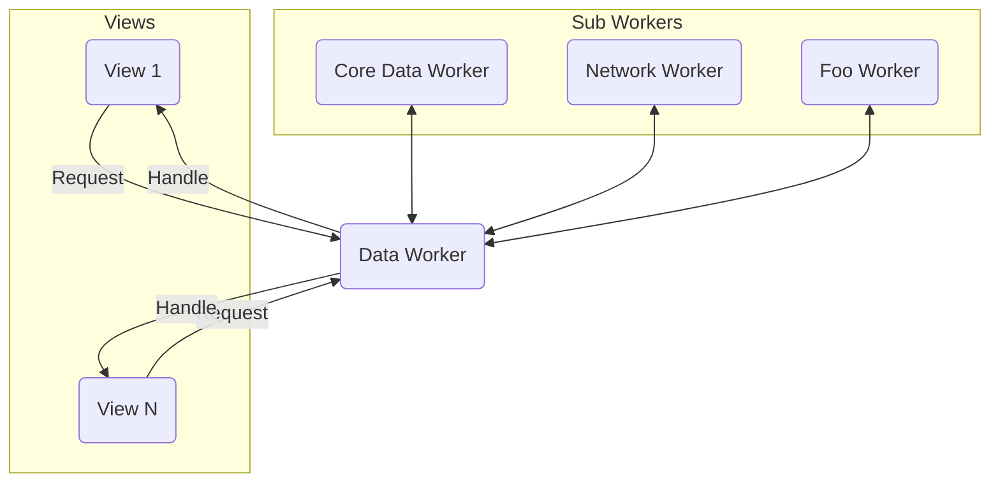

# DeliveryApp

#

Незамысловатый проект реализовывающий следующий функционал:
* CRUD операции с CoreData
* User Defaults
* Взаимодействие с сетью
* Работа с JSON
* Многопоточность
* Таблицы и коллекции
* AutoLayout и ручной layout

Архитектура:

