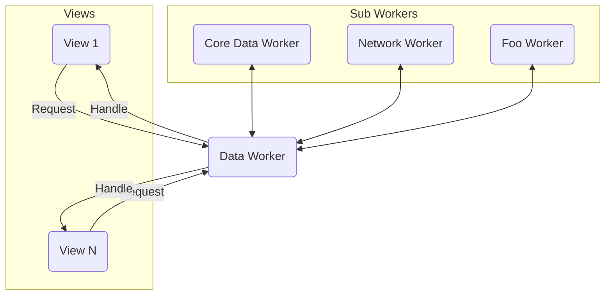

# DeliveryApp
Незамысловатый проект реализовывающий следующий функционал:
* CRUD операции в CoreData
* Взаимодействие с сетью
* Работа с JSON
* Многопоточность
* Таблици и коллекции

Архитектура:

```mermaid
graph TB

    subgraph Views
    direction TB
    View1
    ViewN
    end

    subgraph Sub Workers
    NetworkWorker
    CoreDataWorker
    FooWorker
    end

    View1(View) -->|Request| DataWorker(Data Worker)   
    ViewN(View N) -->|Request| DataWorker(Data Worker)
    DataWorker(Data Worker) -->|Handle| View1(View 1)
    DataWorker(Data Worker) -->|Handle| ViewN(View N)
    CoreDataWorker(Core Data Worker) <--> DataWorker
    NetworkWorker(Network Worker) <--> DataWorker
    FooWorker(Foo Worker) <--> DataWorker
```
